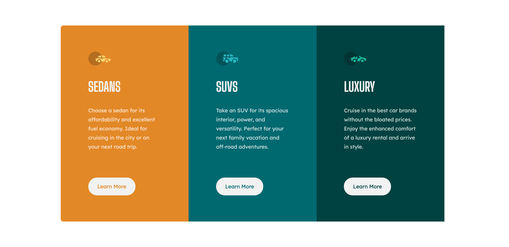
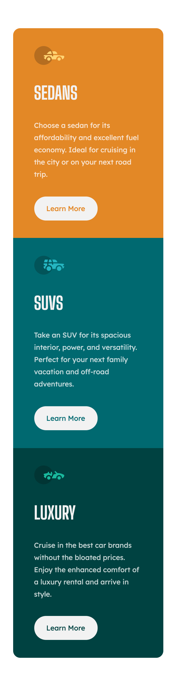

# Frontend Mentor - 3-column preview card component solution

This is a solution to the [3-column preview card component challenge on Frontend Mentor](https://www.frontendmentor.io/challenges/3column-preview-card-component-pH92eAR2-).

## Table of contents

- [Overview](#overview)
  - [Screenshot](#screenshot)
- [My process](#my-process)
  - [Built with](#built-with)
  - [What I learned](#what-i-learned)
  - [Continued development](#continued-development)
- [Author](#author)

## Overview

### Screenshot

Desktop preview

Mobile preview

## My process

### Built with

- [React](https://reactjs.org/) - JS library
- [Styled Components](https://styled-components.com/) - For styles
- Flexbox
- Mobile-first workflow

### What I learned

I've been trying hard not to add too many constraints (e.g. height, width) to elements. Instead, I primarily used margin and padding to place elements, and Flexbox to lay out the components.

As a result, I was able to recreate both the desktop and mobile design provided by Frontend Mentor. I struggled during my final project at Code States because I was adding height and width properties to almost every single element. Now, I feel a lot more comfortable creating elements of the right size and placing them where they need to be.

### Continued development

Still a little unsure about how to use Styled Components. The way I use it currently is not that different from using regular CSS in that I cram all styling into a single component. I do divide up styling based on components but I will have to look into Styled Components best practices to really get a full grasp on the library.

## Author

- Website - [Add your name here](https://www.your-site.com)
- Frontend Mentor - [@yourusername](https://www.frontendmentor.io/profile/yourusername)
